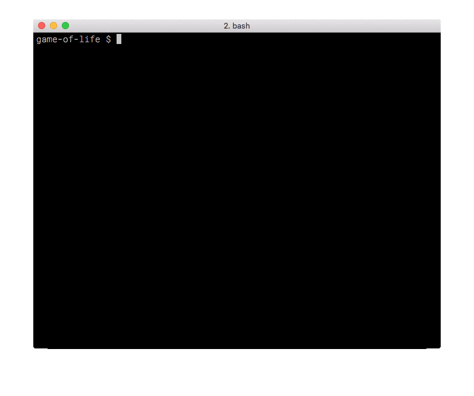

# game-of-life

Code from a Clojure Dojo session to build the Conway's Game Of Life.



## Usage

Data files are available under `./data` directory.
You can change the speed by setting the environment variable `RATE`.

```
export RATE=5
lein run [data-file.edn]

```

## License

Copyright © 2018 Bruno Bonacci and others

Distributed under the Eclipse Public License either version 1.0 or (at
your option) any later version.
